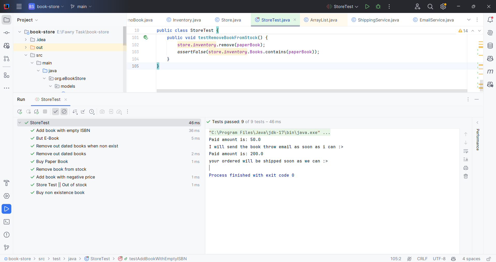

# Book Management System

---

## Overview
This is a Java-based book management system that handles different types of books and their delivery methods.

## Features
- Book management with basic properties (title, ISBN, publish year, price)
- Support for paperback books with shipping capabilities
- Email notification system
- Shipping management

## Class Structure
- `Book` : Base class with core book properties
- `PaperBook` : Extension of Book with shipping functionality
- `EBook` : Extension of Book with sending by email functionality
- `DemoBook` : Extension of Book without sale it.

## Properties
Books can be managed with the following attributes:
- Title
- ISBN
- Publication Date
- Price
- Shipping Address (for paperbooks)
- Quantity

## Test Results
The following screenshot shows that all test cases run successfully:

 